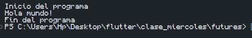

# Proyecto de Evaluación de Ejercicios y Aplicaciones

## Estructura del Repositorio

Este repositorio contiene los ejercicios y aplicaciones evaluados en el curso, organizados de la siguiente manera:

### Enlaces de interés

- [Repositorio en GitHub](https://github.com/CarlosMR75/Actividades_Flutter_DDI) - Enlace al repositorio con el código fuente y capturas de pantalla.

## Ejercicios

### Ejercicios del 01 al 04:
1. **Hello World**
   - Archivo: [hello_world.dart](./dart_basics_01/lib/main.dart)
   - Código:
   ```dart
   void main() {
      String name = "Carlos Mata";
      print("Hola, $name!");
   }
   ```
   - Captura: 
2. **Variables**
   - Archivo: [dart_basics_01.dart](./dart_basics_01/bin/dart_basics_01.dart)
   - Código: 
   ```dart
   // * Declarar variables
   int contador;
   String nombre;
   double nota;
   bool esAdulto;
   
   // * Asignamos nombres a unas variables
   contador = 0;
   nombre = "Carlos";
   nota = 8.5;
   esAdulto = true;
   ```
   - Captura: 
3. **Maps**
   - Código: [maps.dart](./dart_basics_01/bin/dart_iterables.dart)
   - Código:
   ```dart
   // * Crear un mapa
   Map<String, int> verduras = {
      "Cilantro": 1,
      "Zanahoria": 3,
      "Apio": 5,
      "Coliflor": 2
   };
   print(verduras);

   verduras.remove("Zanahoria");
   print(verduras);

   verduras["Papas"] = 8;
   print(verduras);

   print(verduras.isEmpty);
   print(verduras.length);
   print(verduras.keys);
   print(verduras.values);
   ```
   - Captura: 
4. **List, maps and Iterables**
   - Archivo: [list_maps_iterables.dart](./dart_basics_01/bin/dart_iterables.dart)
   - Código:
   ```dart
   import 'dart:ffi';

   void main() {
   // * Declarar lista
   var numeros = [1, 3, 6, 8, 7];
   // * Recorrer la lista para imprimir los valores
   for (var i in numeros) {
      print(i);
   }
   // * Recorrer la lista para imprimir los valoress
   print("Recorriendo con ForEach");
   numeros.forEach((i) => print(i));

   // * Añadir valores a la lista
   numeros.add(5);
   print(numeros);

   // * Remover valores
   numeros.remove(8);
   print(numeros);

   // * Crear un mapa
   Map<String, int> verduras = {
      "Cilantro": 1,
      "Zanahoria": 3,
      "Apio": 5,
      "Coliflor": 2
   };
   print(verduras);

   verduras.remove("Zanahoria");
   print(verduras);

   verduras["Papas"] = 8;
   print(verduras);

   print(verduras.isEmpty);
   print(verduras.length);
   print(verduras.keys);
   print(verduras.values);

   for (var verdura in verduras.entries) {
      print("${verdura.key}:${verdura.value}");
   }
   }
   ```
   - Captura: 

#### Ejercicios del 05 al 08:
5. **Functions**
   - Archivo: [dart_functions.dart](./dart_basics_01/lib/dart_functions.dart)
   - Código:
   ```dart
   // * Crear una función que salude
   void saludar() {
   print("Hola");
   }

   void ejecutarOperacion(int x, int y, int Function(int, int) operacion) {
   var resultado = operacion(x, y);
   print("El resultado es: ${resultado}");
   }

   int sumar(int x, int y) {
   return x + y;
   }

   int restar(int x, int y) {
   return x - y;
   }

   int multiplicar(int x, int y) {
   return x * y;
   }

   int dividir(int x, int y) {
   return x ~/ y;
   }

   Function crearMultiplicador(int factor) {
   return (int numero) => numero * factor;
   }
   ```
   - Captura: 
6. **Classes**
   - Archivo: [dart_clases.dart](./dart_basics_01/bin/dart_clases.dart)
   - Código:
   ```dart
   import 'package:dart_basics_01/coche.dart';

   void main() {
   var micoche = Coche("Chevrolet", "Chevy Pickup", 2024);
   micoche.mostrarDetalles();

   var otrocoche = Coche("Ford", "Falcon", 1968);
   otrocoche.mostrarDetalles();

   var cochenuevo = Coche("Toyota", "Corolla", 2020);
   cochenuevo.mostrarDetalles();

   var unCocheMas = Coche.soloMarca("Nissan");
   unCocheMas.mostrarDetalles();
   }
   ```
   - Captura: 
7. **Constructors and names**
   - Código: [constructors_names.dart](./ejercicios/constructors_names.dart)
   - Captura: 
8. **Get and Set**
   - Código: [get_set.dart](./ejercicios/get_set.dart)
   - Captura: 

#### Ejercicios del 09 al 15:
9. **Abstract class**
   - Archivo: [abstract_class.dart](./clase_miercoles/abstract_class/bin/figura.dart)
   - Código:
   ```dart
   abstract class Figura {
      double calcularArea();
   }

   class Circulo extends Figura {
      double radio;
      Circulo(this.radio);

      @override
      double calcularArea() {
         return 3.14 * radio * radio;
      }
   }

   class Rectangulo extends Figura {
      double ancho, alto;
      Rectangulo(this.ancho, this.alto);

      @override
      double calcularArea() {
         return ancho * alto;
      }
   }

   void main() {
      var c = Circulo(15);
      var r = Rectangulo(3, 5);
      print('Área del círculo: ${c.calcularArea()}');
      print('Área del rectángulo: ${r.calcularArea()}');
   }
   ```
   - Captura: 
   
10. **Mixins**
   - Código: [mixins.dart](./clase_miercoles/mixins/bin/mixins.dart)
   - Código:
   ```dart
   //Definir un mixin
   mixin Volador {
      void volar() {
         print("Estoy volando");
      }
   }

   mixin Corredor {
      void correr() {
         print("Estoy corriendo");
      }
   }

   class Pajaro with Volador, Corredor {}

   void main() {
      var pajaro = Pajaro();
      pajaro.volar();
      pajaro.correr();
   }
   ```
   - Captura: 
11. **Futures**
   - Archivo: [futures.dart](./clase_miercoles/futures/bin/futures.dart)
   - Código:
   ```dart
   void main() {
   print("Inicio del programa");

   Future(() {
      return 'Hola mundo!';
   }).then((resultado) {
      print(resultado);
   });

   print("Fin del programa");
   }
   ```
   - Captura: 
12. **Async Await**
   - Archivo: [async_await.dart](./clase_miercoles/futures/bin/async_await.dart)
   - Código: 
   ```dart
   void main() async {
   print("Inicio del programa");

   String resultado = await Future(() {
      return "Hola mundo!";
   });

   print(resultado);
   print('Fin del programa');
   }
   ```
   - Captura: 
13. **Try catch finally**
   - Archivo: [try_catch.dart](./clase_miercoles/try_catch/bin/try_catch.dart)
   - Código: 
   ```dart
   void main() {
   try {
      int resultado = 10 ~/ 0;
      print("El resultado es $resultado");
   } catch (e, s) {
         print("Se produjo una excepción $e");
         print("Su descripción es $s");
      } finally {
         print("Procura no dividir entre cero");
      }
   }
   ```
   - Captura: 
14. **Streams**
   - Código: [streams.dart](./clase_miercoles/streams/bin/streams.dart)
   - Código:
   ```dart
   void main() {
      Stream<int> stream =
            Stream<int>.periodic(Duration(seconds: 1), (count) => count)
               .take(5); //Stream.periodic
      stream.listen((data) => print('Data recibida: $data'));

      Stream<int> otroStream = Stream.fromIterable([6, 7, 8, 9, 10]);
      otroStream.listen((data) {
         print("Data recibida: $data");
      });
   }
   ```
   - Captura: 
15. **Stream await**
   - Código: [stream_await.dart](./clase_miercoles/streams/bin/azync_await_streams.dart)
   - Código
   ```dart
   void main() async {
      Stream<int> stream =
            Stream.periodic(Duration(seconds: 1), (contador) => contador)
               .take(5); //Stream periodic
      await for (var data in stream) {
         print("Data recibida: $data");
      }
   }
   ```
   - Captura: 

### Proyectos de Flutter

- **Aplicación HelloWorld**
  - Código: [hello_world_carlos_mata](./hello_world_carlos_mata/lib/main.dart)
  - Captura: 

- **Aplicación YesOrNo**
  - Código: [cemr_yes_no_app](./cemr_yes_no_app/lib/main.dart)
  - Capturas: 
  
  

- **Proyecto con Arquitectura** 
  - Código: [ddi_phone](./ddi_phone/lib/main.dart)
  - Capturas: 
  
  
## Descargar el proyecto

1. Clonar el repositorio:
   ```bash
   git clone https://github.com/CarlosMR75/Actividades_Flutter_DDI.git
